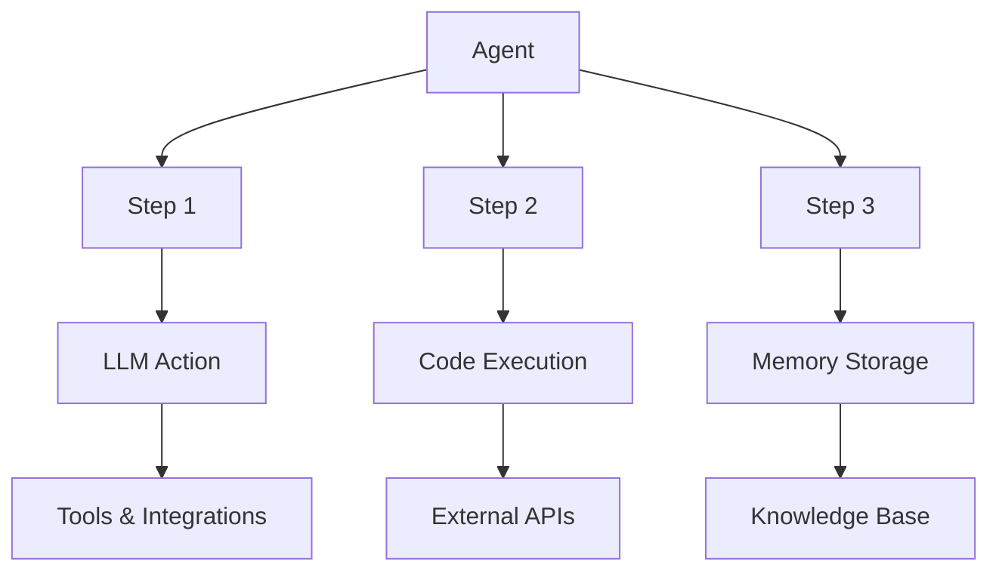

# Core Concepts Overview

Erdo is built around a few key concepts that work together to create powerful AI automation workflows. Understanding these concepts will help you build effective agents and leverage the full potential of the platform.

## Platform Architecture

<CardGroup cols={2}>
  <Card title="Agents" icon="robot" href="/concepts/agents">
    The main containers for AI workflows - define what your automation does
  </Card>
  <Card title="Steps" icon="list" href="/concepts/steps">
    Individual actions within agents - the building blocks of workflows
  </Card>
  <Card title="Actions" icon="bolt" href="/sdk/actions">
    Specific operations like LLM calls, code execution, or web searches
  </Card>
  <Card
    title="Result Handlers"
    icon="code-branch"
    href="/concepts/result-handlers"
  >
    Conditional logic that responds to step outcomes and controls workflow flow
  </Card>
  <Card title="Tools" icon="wrench" href="/concepts/tools">
    External integrations that extend agent capabilities
  </Card>
</CardGroup>

## How It All Works Together



### 1. Agents

**Agents** are the top-level containers that define complete workflows. They:

- Orchestrate multiple steps
- Define execution order and dependencies
- Handle errors and retries
- Manage resources and permissions

### 2. Steps

**Steps** are the individual actions within an agent. Each step:

- Performs one specific operation
- Can depend on previous steps
- Has configurable execution conditions
- Produces outputs for subsequent steps

### 3. Actions

**Actions** define what each step actually does:

- **LLM Actions**: Generate text, analyze content, make decisions
- **Code Execution**: Run Python code for data processing
- **Memory Actions**: Store and retrieve knowledge
- **Web Research**: Search and parse web content
- **Utility Actions**: Data transformation and flow control

### 4. Result Handlers

**Result Handlers** add conditional logic to your workflows:

- **Conditional Execution**: Run different steps based on outcomes
- **Error Recovery**: Handle failures and implement retry logic
- **Dynamic Routing**: Branch workflows based on data or results
- **Success Actions**: Execute follow-up steps when conditions are met

### 5. Tools & Integrations

**Tools** extend agent capabilities:

- Web search and content parsing
- API integrations
- Database connections
- File processing
- Custom functions

## Key Features

<AccordionGroup>
  <Accordion title="Intelligent Workflows">
    - Conditional execution based on data and results
    - Dynamic branching and decision making
    - Parallel processing for efficiency
    - Automatic retry and error handling
  </Accordion>

{" "}

<Accordion title="Memory & Learning">
  - Persistent knowledge storage across executions - Semantic search for
  relevant information - Organizational knowledge sharing - Continuous learning
  from interactions
</Accordion>

{" "}

{" "}

<Accordion title="Security Features">
  - Sandboxed code execution environment - Role-based access controls - Secure
  credential management - Input validation and safety controls
</Accordion>

  <Accordion title="Scalability & Performance">
    - Auto-scaling based on workload
    - Resource limits and optimization
    - Monitoring and alerting
    - Production-ready deployment
  </Accordion>
</AccordionGroup>

## Common Workflow Patterns

### Data Analysis Pipeline

```
Input Data → Validation → Processing → Analysis → Insights → Storage
```

### Research Automation

```
Query → Web Search → Content Analysis → Synthesis → Report Generation
```

### Business Process Automation

```
Trigger Event → Data Collection → Decision Logic → Action Execution → Notification
```

### Content Processing

```
Raw Content → Classification → Extraction → Transformation → Distribution
```

## Getting Started Path

<Steps>
  <Step title="Understand Agents">
    Learn how agents work and what makes them powerful
  </Step>
  <Step title="Master Steps">
    Understand how to build workflows with individual steps
  </Step>
  <Step title="Explore Actions">
    Discover all the actions available for your steps
  </Step>
  <Step title="Build Your First Agent">
    Create a simple automation to see concepts in action
  </Step>
</Steps>

## Best Practices

<Tabs>
  <Tab title="Design Principles">
    - **Single Responsibility**: Each agent should have one clear purpose -
    **Modular Steps**: Break complex logic into smaller, reusable steps -
    **Error Handling**: Always plan for failure scenarios - **Documentation**:
    Clearly document agent purpose and usage
  </Tab>
  <Tab title="Performance">
    - **Parallel Execution**: Use parallel steps where possible - **Resource
    Management**: Set appropriate limits and timeouts - **Caching**: Cache
    expensive operations and API calls - **Monitoring**: Track performance and
    optimization opportunities
  </Tab>
  <Tab title="Security">
    - **Input Validation**: Always validate external inputs - **Access
    Control**: Use appropriate visibility settings - **Credential Management**:
    Use secure storage for API keys - **Resource Limits**: Set appropriate
    constraints and timeouts
  </Tab>
</Tabs>

## Next Steps

Ready to dive deeper? Here's where to go next:

<CardGroup cols={2}>
  <Card title="Build Your First Agent" icon="rocket" href="/quickstart">
    Follow our quick start guide to create your first agent
  </Card>
  <Card title="Explore Examples" icon="code" href="/examples">
    See real-world examples of agents in action
  </Card>
  <Card title="SDK Reference" icon="book" href="/sdk/overview">
    Complete reference for building agents with code
  </Card>
  <Card title="CLI Tools" icon="terminal" href="/cli/overview">
    Learn the command-line tools for development
  </Card>
</CardGroup>
