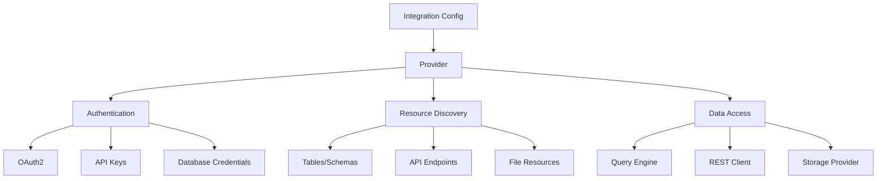
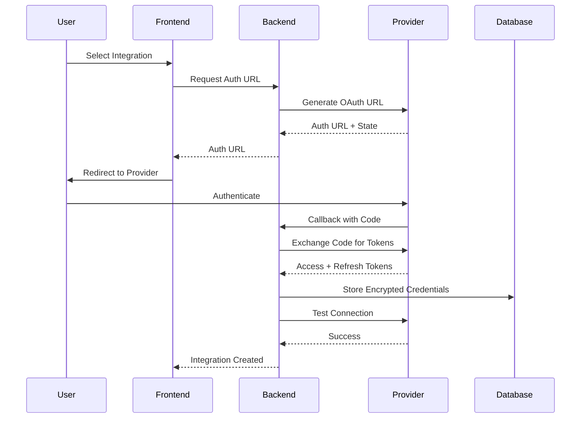

# Integrations Overview

Erdo's integration system enables seamless connection to external data sources, APIs, and services. This powerful framework supports databases, cloud services, business applications, and custom APIs with automated resource discovery, credential management, and data synchronization.

## Core Concepts

### Integration Architecture

Erdo integrations consist of several key components:



### Integration Types

<CardGroup cols={3}>
  <Card title="Database Integrations" icon="database">
    - PostgreSQL - BigQuery - MySQL - SQL Server - MongoDB
  </Card>
  <Card title="Business Applications" icon="briefcase">
    - Salesforce - HubSpot - Stripe - Google Workspace - Microsoft 365
  </Card>
  <Card title="Cloud Services" icon="cloud">
    - AWS S3 - Google Cloud Storage - Azure Blob Storage - Snowflake -
    Databricks
  </Card>
  <Card title="APIs & Webhooks" icon="plug">
    - REST APIs - GraphQL - Custom endpoints - Real-time webhooks - OpenAPI
    specs
  </Card>
  <Card title="File Systems" icon="folder">
    - Local files - Network drives - FTP/SFTP - SharePoint - Dropbox
  </Card>
  <Card title="Analytics Platforms" icon="chart-bar">
    - Google Analytics - Mixpanel - Segment - Adobe Analytics - Custom tracking
  </Card>
</CardGroup>

## Available Integrations

### Production Ready

<Tabs>
  <Tab title="Databases">
    **PostgreSQL**
    - Full schema discovery
    - Real-time query execution
    - Relationship mapping
    - Performance optimization

    **BigQuery**
    - Dataset enumeration
    - Table metadata extraction
    - Partitioning support
    - Cost optimization

    **SQL Server**
    - Schema introspection
    - Stored procedure support
    - Index analysis
    - Query performance insights

  </Tab>

  <Tab title="Business Apps">
    **Salesforce**
    - Object discovery
    - Field mapping
    - Relationship tracking
    - Real-time sync

    **HubSpot**
    - Contact management
    - Deal pipeline analysis
    - Marketing automation
    - Custom properties

    **Stripe**
    - Payment processing
    - Subscription management
    - Revenue analytics
    - Customer insights

  </Tab>

  <Tab title="Google Services">
    **Google Sheets**
    - Spreadsheet access
    - Range selection
    - Formula support
    - Collaborative editing

    **Google Drive**
    - File discovery
    - Content extraction
    - Permission management
    - Version tracking

  </Tab>
</Tabs>

### Beta & Coming Soon

<CardGroup cols={2}>
  <Card title="Beta Integrations" icon="flask">
    - Meta Ads (advertising insights) - Google Ads (campaign metrics) - Twitter
    API (social analytics) - LinkedIn (professional data)
  </Card>
  <Card title="Coming Soon" icon="clock">
    - Shopify (e-commerce data) - Zendesk (support tickets) - Jira (project
    management) - Slack (team communications)
  </Card>
</CardGroup>

## Integration Configuration

### Provider Setup

Each integration is backed by a provider configuration:

```go
// Integration provider definition
type IntegrationConfig struct {
    Name                string              `json:"name"`
    Key                 string              `json:"key"`
    Type               IntegrationType      `json:"type"`
    AuthTypes          []AuthType           `json:"auth_types"`
    Status             ConfigStatus         `json:"status"`
    Description        string              `json:"description"`
    ProviderID         uuid.UUID           `json:"provider_id"`

    // Authentication configuration
    AuthURL            string              `json:"auth_url"`
    TokenURL           string              `json:"token_url"`
    ClientID           string              `json:"client_id"`
    ClientSecret       string              `json:"client_secret"`
    AvailableScopes    []string           `json:"available_scopes"`
    OptionalScopes     []string           `json:"optional_scopes"`

    // Resource discovery
    SegmentConfig      SegmentConfig       `json:"segment_config"`
    CredentialSchema   CredentialSchema    `json:"credential_schema"`
    ResourceDiscovery  ResourceDiscoveryConfig `json:"resource_discovery"`

    // UI and branding
    UIConfig           UIConfig            `json:"ui_config"`
    DocumentationURL   string              `json:"documentation_url"`
}
```

### Authentication Methods

Erdo supports multiple authentication patterns:

<AccordionGroup>
  <Accordion title="OAuth 2.0">
    Most modern APIs use OAuth 2.0 for secure authentication:

    ```go
    // OAuth configuration
    oauth_config := OAuthConfig{
        AuthURL:      "https://api.provider.com/oauth/authorize",
        TokenURL:     "https://api.provider.com/oauth/token",
        ClientID:     "your_client_id",
        ClientSecret: "your_client_secret",
        Scopes: []string{
            "read:data",
            "write:data",
            "admin:resources"
        },
        RedirectURL: "https://erdo.ai/auth/callback"
    }
    ```

  </Accordion>

  <Accordion title="API Keys">
    Simple API key authentication for straightforward APIs:

    ```go
    // API Key configuration
    api_key_config := APIKeyConfig{
        Header:      "X-API-Key",
        Value:       "your_api_key",
        QueryParam:  "",  // Alternative to header
        Location:    "header"  // or "query" or "body"
    }
    ```

  </Accordion>

  <Accordion title="Database Credentials">
    Username/password authentication for databases:

    ```go
    // Database connection
    db_config := DatabaseConfig{
        Host:     "database.example.com",
        Port:     5432,
        Database: "production_db",
        Username: "readonly_user",
        Password: "secure_password",
        SSLMode:  "require"
    }
    ```

  </Accordion>

  <Accordion title="Custom Authentication">
    Flexible authentication for specialized systems:

    ```go
    // Custom auth implementation
    custom_auth := CustomAuth{
        Method:      "bearer_token",
        Headers:     map[string]string{
            "Authorization": "Bearer {{token}}",
            "X-Custom-Header": "{{custom_value}}"
        },
        Parameters:  map[string]string{
            "api_version": "v2",
            "format":     "json"
        }
    }
    ```

  </Accordion>
</AccordionGroup>

## Resource Discovery

### Automatic Discovery

Erdo automatically discovers available resources from integrations:

```go
// Database resource discovery
type DatabaseResourceDiscovery struct {
    TableQuery: `
        SELECT
            t.table_schema,
            t.table_name,
            pd.description as table_description,
            string_agg(
                format('%s (%s%s)',
                    c.column_name,
                    c.data_type,
                    CASE WHEN c.is_nullable = 'YES' THEN ', nullable' ELSE '' END
                ),
                E'\n'
            ) as columns
        FROM information_schema.tables t
        JOIN information_schema.columns c ON c.table_schema = t.table_schema
        WHERE t.table_schema = ANY($1)
        GROUP BY t.table_schema, t.table_name, pd.description
        ORDER BY t.table_schema, t.table_name
    `,

    RelationshipQuery: `
        SELECT
            tc.table_schema as source_schema,
            tc.table_name as source_table,
            kcu.column_name as source_column,
            ccu.table_schema as target_schema,
            ccu.table_name as target_table,
            ccu.column_name as target_column
        FROM information_schema.table_constraints tc
        JOIN information_schema.key_column_usage kcu ON tc.constraint_name = kcu.constraint_name
        JOIN information_schema.constraint_column_usage ccu ON ccu.constraint_name = tc.constraint_name
        WHERE tc.constraint_type = 'FOREIGN KEY'
        AND tc.table_schema = ANY($1)
    `
}
```

### API Resource Discovery

For APIs, resources are discovered using configuration:

```go
// API resource discovery configuration
type APIResourceDiscovery struct {
    BaseURL: "https://api.provider.com/v1",
    ResourceTypes: []ResourceTypeConfig{
        {
            Type:        "endpoint",
            URLTemplate: "/endpoints",
            Method:      "GET",
            IDPath:      "$.data[*].id",
            NamePath:    "$.data[*].name",
            DescriptionPath: "$.data[*].description"
        },
        {
            Type:        "dataset",
            URLTemplate: "/datasets",
            Method:      "GET",
            IDPath:      "$.datasets[*].id",
            NamePath:    "$.datasets[*].title"
        }
    }
}
```

### Custom Discovery

Implement custom discovery logic for specialized systems:

```go
// Custom resource discoverer
type CustomResourceDiscoverer struct {
    provider DatabaseProvider
    engine   QueryEngine
}

func (d *CustomResourceDiscoverer) DiscoverResources(ctx context.Context, config map[string]any) ([]*Resource, error) {
    // Custom discovery logic
    resources := []*Resource{}

    // Discover tables
    tables, err := d.discoverTables(ctx, config)
    if err != nil {
        return nil, err
    }
    resources = append(resources, tables...)

    // Discover views
    views, err := d.discoverViews(ctx, config)
    if err != nil {
        return nil, err
    }
    resources = append(resources, views...)

    // Discover stored procedures
    procedures, err := d.discoverProcedures(ctx, config)
    if err != nil {
        return nil, err
    }
    resources = append(resources, procedures...)

    return resources, nil
}
```

## Data Access Patterns

### Query Engines

Different integrations use specialized query engines:

<Tabs>
  <Tab title="SQL Databases">
    ```go
    // SQL query engine
    type SQLQueryEngine struct {
        db *sql.DB
    }

    func (e *SQLQueryEngine) ExecuteQuery(ctx context.Context, query string, params ...interface{}) (*QueryResult, error) {
        rows, err := e.db.QueryContext(ctx, query, params...)
        if err != nil {
            return nil, err
        }
        defer rows.Close()

        return e.parseRows(rows)
    }

    func (e *SQLQueryEngine) GetSchemas(ctx context.Context) ([]Schema, error) {
        query := `
            SELECT schema_name, description
            FROM information_schema.schemata
            WHERE schema_name NOT IN ('information_schema', 'pg_catalog')
        `
        result, err := e.ExecuteQuery(ctx, query)
        return e.parseSchemas(result), err
    }
    ```

  </Tab>

  <Tab title="REST APIs">
    ```go
    // REST API client
    type RESTClient struct {
        baseURL    string
        httpClient *http.Client
        auth       AuthProvider
    }

    func (c *RESTClient) Get(ctx context.Context, endpoint string, params map[string]string) (*APIResponse, error) {
        req, err := c.buildRequest("GET", endpoint, nil, params)
        if err != nil {
            return nil, err
        }

        // Apply authentication
        if err := c.auth.PrepareRequest(ctx, req); err != nil {
            return nil, err
        }

        resp, err := c.httpClient.Do(req)
        if err != nil {
            return nil, err
        }

        return c.parseResponse(resp)
    }
    ```

  </Tab>

  <Tab title="Cloud Storage">
    ```go
    // Cloud storage provider
    type CloudStorageProvider struct {
        client StorageClient
        bucket string
    }

    func (p *CloudStorageProvider) ListObjects(ctx context.Context, prefix string) ([]*StorageObject, error) {
        objects := []*StorageObject{}

        it := p.client.Bucket(p.bucket).Objects(ctx, &storage.Query{
            Prefix: prefix,
        })

        for {
            obj, err := it.Next()
            if err == iterator.Done {
                break
            }
            if err != nil {
                return nil, err
            }

            objects = append(objects, &StorageObject{
                Name:     obj.Name,
                Size:     obj.Size,
                Modified: obj.Updated,
            })
        }

        return objects, nil
    }
    ```

  </Tab>
</Tabs>

## Credential Management

### Secure Storage

Erdo provides enterprise-grade credential security:

```go
// Credential encryption
func EncryptCredentials(credentials map[string]string, orgKey string) (string, error) {
    // Serialize credentials
    data, err := json.Marshal(credentials)
    if err != nil {
        return "", err
    }

    // Encrypt with organization-specific key
    encrypted, err := encryption.Encrypt(string(data), orgKey)
    if err != nil {
        return "", err
    }

    return encrypted, nil
}

// Credential retrieval with decryption
func (a *BaseAuth) GetCredentials(ctx context.Context) (map[string]string, error) {
    // Decrypt stored credentials
    credentials, err := a.decryptCredentials()
    if err != nil {
        return nil, err
    }

    // Apply credential schema transformations
    processed, err := a.processCredentialSchema(credentials)
    if err != nil {
        return nil, err
    }

    return processed, nil
}
```

### Credential Sources

Credentials can come from multiple sources:

<AccordionGroup>
  <Accordion title="Integration Credentials">
    Stored securely with the integration instance:

    ```go
    credentials := map[string]string{
        "access_token":  "encrypted_oauth_token",
        "refresh_token": "encrypted_refresh_token",
        "api_key":      "encrypted_api_key",
        "username":     "database_user",
        "password":     "encrypted_password"
    }
    ```

  </Accordion>

  <Accordion title="Provider Credentials">
    Shared across integration instances:

    ```go
    provider_credentials := map[string]string{
        "developer_token": "shared_dev_token",
        "client_secret":   "oauth_client_secret",
        "signing_key":     "webhook_signing_key"
    }
    ```

  </Accordion>

  <Accordion title="Dataset Parameters">
    Specific to individual datasets:

    ```go
    dataset_params := map[string]string{
        "spreadsheet_id": "google_sheet_id",
        "database_name":  "specific_database",
        "table_prefix":   "data_prefix"
    }
    ```

  </Accordion>

  <Accordion title="Segment Selections">
    From user-selected data segments:

    ```go
    segment_data := map[string]string{
        "account_id":   "selected_account",
        "campaign_ids": "campaign_1,campaign_2",
        "date_range":   "last_30_days"
    }
    ```

  </Accordion>
</AccordionGroup>

## Integration Lifecycle

### Creating Integrations



### Resource Synchronization

```go
// Background sync process
func (s *IntegrationService) SyncResources(ctx context.Context, integrationID uuid.UUID) error {
    // Get integration and provider
    integration, err := s.getIntegration(ctx, integrationID)
    if err != nil {
        return err
    }

    provider, err := s.getProvider(integration)
    if err != nil {
        return err
    }

    // Discover resources
    resources, err := provider.GetDatasetResources(ctx)
    if err != nil {
        return err
    }

    // Update resource database
    for _, resource := range resources {
        err := s.upsertResource(ctx, resource)
        if err != nil {
            log.Printf("Failed to upsert resource %s: %v", resource.Key, err)
        }
    }

    // Create analyses for new resources
    err = s.createResourceAnalyses(ctx, resources)
    if err != nil {
        log.Printf("Failed to create analyses: %v", err)
    }

    return nil
}
```

## Best Practices

<AccordionGroup>
  <Accordion title="Security">
    **Credential Encryption**: Always encrypt sensitive credentials using organization-specific keys

    **Access Control**: Implement proper RBAC for integration access

    **Token Refresh**: Automatically refresh OAuth tokens before expiration

    **Audit Logging**: Log all integration access and modifications

  </Accordion>

  <Accordion title="Performance">
    **Connection Pooling**: Use connection pools for database integrations

    **Rate Limiting**: Respect API rate limits and implement backoff strategies

    **Caching**: Cache frequently accessed resources and metadata

    **Batch Operations**: Use batch APIs when available for bulk operations

  </Accordion>

  <Accordion title="Reliability">
    **Error Handling**: Implement comprehensive error handling and retry logic

    **Health Checks**: Regular health checks for integration connectivity

    **Graceful Degradation**: Handle integration failures without breaking workflows

    **Monitoring**: Monitor integration performance and availability

  </Accordion>

  <Accordion title="Data Quality">
    **Schema Validation**: Validate data schemas and handle changes

    **Data Lineage**: Track data sources and transformations

    **Quality Metrics**: Monitor data quality and completeness

    **Change Detection**: Detect and handle schema or data changes

  </Accordion>
</AccordionGroup>

## Troubleshooting

### Common Issues

**Authentication Failed**

```bash
Error: OAuth token expired or invalid
```

Check token expiration and refresh tokens. Verify OAuth configuration.

**Resource Discovery Failed**

```bash
Error: Failed to discover resources
```

Verify credentials and permissions. Check API endpoints and query syntax.

**Connection Timeout**

```bash
Error: Connection to provider timed out
```

Check network connectivity and firewall settings. Verify endpoint URLs.

### Debugging Integration Issues

Enable detailed logging for integrations:

```go
log.Printf("Integration %s: Attempting connection to %s", integration.Name, provider.GetEndpoint())
log.Printf("Using credentials: %v", maskCredentials(credentials))
log.Printf("Discovery config: %+v", provider.GetDiscoveryConfig())
```

Test integration connectivity:

```bash
# Test integration health
curl -X GET "https://api.erdo.ai/integrations/{id}/health" \
  -H "Authorization: Bearer YOUR_TOKEN"

# Test resource discovery
curl -X POST "https://api.erdo.ai/integrations/{id}/discover" \
  -H "Authorization: Bearer YOUR_TOKEN"
```
